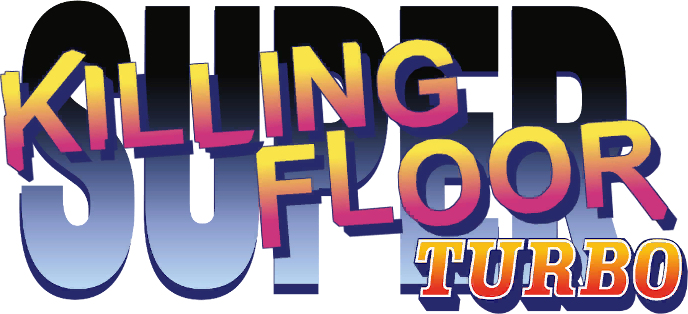

# KFTurbo

## What is KFTurbo?
KFTurbo is a vanilla-adjacent balance overhaul mod.
The goal is to eliminate the high-level 'meta' for Hell on Earth.
In the base game, sharpshooter and demolitions are extremely dominant, and 75% of the weapons available in the game are just simply not used.

## Perk Balance
KFTurbo brings outlier perks such as Firebug and Berserker back in line with the rest of the perks.
It also enables most perks to deal with larger zeds in some way, although some of them require very high skill to pull off.
Some perk-specific mechanics are repurposed such as Fire DoT/burning to be more team-oriented.
Offperking is more viable due to the buff to many of the unused weapons, allowing for varied loadouts.

## Weapon Balance
KFTurbo elevates most "trash" or "starter" or "tier 1" weapons a unique niche that merits using them at a much higher range of situations and waves.
Each weapon has some sort of unique quirk, where it promotes a specific playstyle, so everyone can find the weapon they like playing with the most, and not gravitate towards 2-3 weapons that are considered all-around best.
Some ridiculously overpowered weapons are brought down to a median-level, which is equated to the power of loadouts such as M14+LAR. 
This does not mean every weapon will melt FPs and Scrakes, but they will do just fine in a team-environment.

## Bug Fixes
Longstanding and notorious bugs such as slow-raging, pacification, post-death damage are completely fixed.
Zed hitbox corruption is reduced wherever it was possible. The game is still jank, but that's part of its charm.
A lot of cheese tactics are eliminated, or made to be harder to pull off.

## Zed Variants
There are a few vanilla-adjacent Zeds that are meant to spice up the early waves, which can be extremely boring with a good team.
Watch out for custom Crawlers/Gorefasts/Bloats and the rest!
Scrakes and Fleshpounds will not have variants as they are fairly challenging on their own.

## Randomizer Mode
Check out [TurboRandomizer](https://github.com/KFPilot/KFTurboRandomizer) if you are looking for a fresh experience. 
It selects from a list of over 120 arbitrary loadouts to give to each player, putting your skills with every weapon in the game to the test.

## Changelog
You can find all the changes compared to the base game [here.](./changelog.md)
